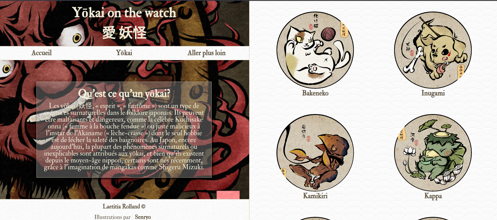
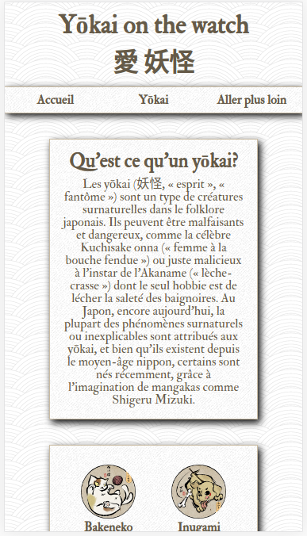

# Bienvenue sur 'Yokai on the watch'

  

Il s'agit d'un projet personnel, sur le format d'un **blog**, ayant pour sujet les êtres fascinants que sont les *yōkai*.
Je souhaitais que les pages de chaque yōkai soit générée dynamiquement.

## Qui suis-je?

J'ai quitté mon travail dans la biologie médicale il y a 3 mois et j'ai commencé une formation intensive avec O'clock, il y a 1mois.
J'ai ainsi découvert PHP, et j'ai adoré!
J'ai profité de quelques jours off cette semaine pour me lancer ce défi dingue! Créer ce blog from scratch, après seulement 1 mois de formation.
Je voulais voir si j'en étais capable.

Je suis très à l'écoute de tous les conseils ou critiques constructives sur mon projet, il y a sans doute des choses que je n'ai fait selon les règles de l'art.

## Langages

* HTML
* CSS
* PHP
* **Pas de framework, ni de librairies.**

## Responsive

Oui! il a été développé en mobile-first. La version mobile et la version PC sont assez différentes. 

## Progression et améliorations à venir
### Progression
Le projet est quasiment fini mais la page *aller plus loin* est en construction, le travail d'écriture était trop important pour que je puisse finir mon projet en 4 jours.

### Améliorations à venir
Je commence l'apprentissage de Javascript et j'espère pouvoir l'utiliser notamment pour la gestion du sous-menu (je n'en suis pas trop satisfaite), ainsi que pour ajouter un effet sur les liens des articles la page d'accueil.

## Aperçu

                       

## Version en ligne

Il est visible sur mon portfolio - qui doit être retravaillé, je l'avais fait il y a un an, après m'être auto-formée a HTML et CSS.
(http://yokai.laetitia-rolland.com/)

## Contributions

Il s'agit de mon tout premier repo sur Github. Je suis donc avant tout preneuse de conseils ou de critiques sur mon travail.
Je ne suis pas une personne créative, et mon CSS est sans doute assez bordélique, je n'ai pas su comment faire pour que le sous-menu ne dépasse pas sur le contenu.